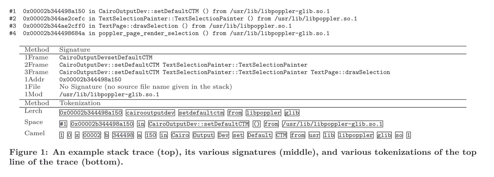
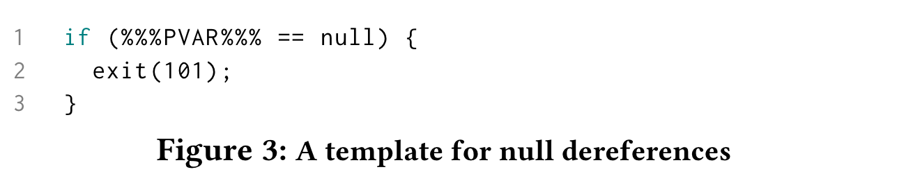
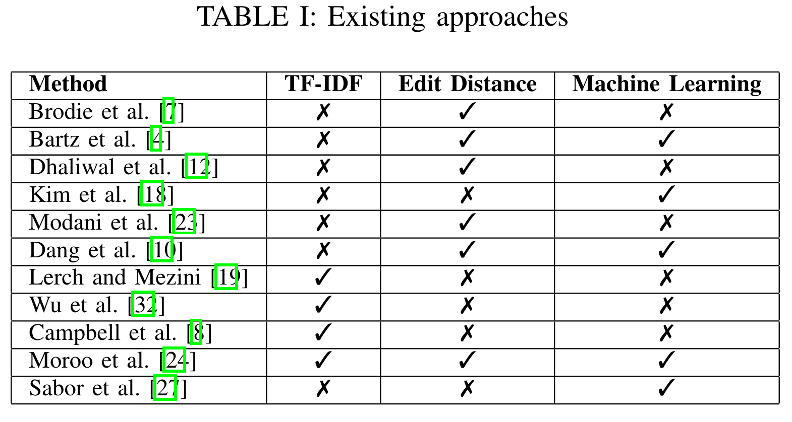
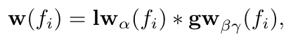
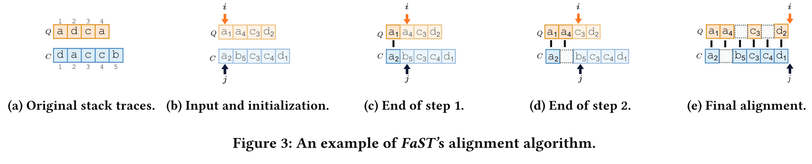
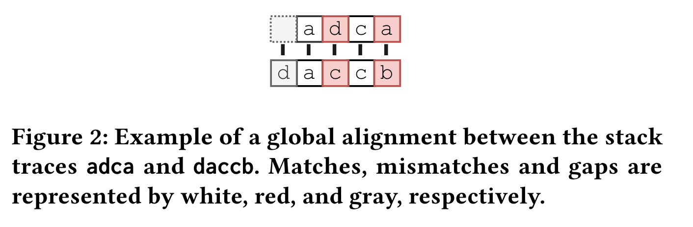
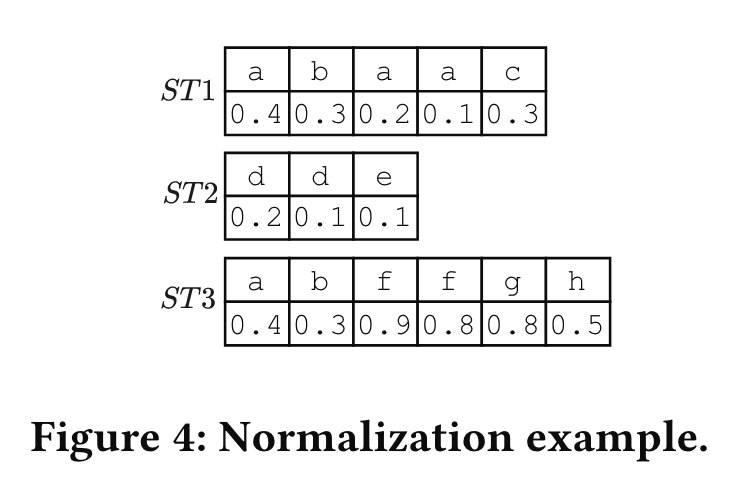
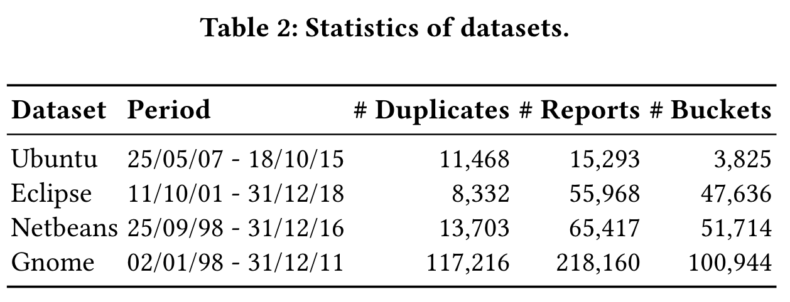

# Literature Review: Test Error Grouping/Crash Bucketing

## 📰 Finding Duplicates of Your Yet Unwritten Bug Report

**Author(s):** Lerch and Mezini

**Year of Publication:** 2013

**Link/DOI:** http://ieeexplore.ieee.org/document/6498456/

### Intro/Summary

The paper addresses the problem of duplicate bug reports using stack traces, focusing specifically on Java. Bugzilla is used as the bug tracker, from which stack traces are extracted.

### Approach

- **Methodology:** Stack traces are often copy-pasted into bug reports as text. The authors extract these stack traces using regular expressions designed based on the known structure of stack traces.
- **Search Index:** A search index is built for available bug reports by processing and extracting stack traces from textual representations.
- **Technique:** Term Frequency and Inverse Document Frequency (TF-IDF) approach.

### Dataset

- **Source:** Bugzilla entries for the Eclipse project, retrieved by Zimmermann for the MSR Mining Challenge 2008.
- **Statistics:**

  - **Total entries:** 211,843.
  - **Bug reports:** 180,886 (entries not tagged as enhancements).
  - **Stack trace coverage:** 18,469 bug reports (~10%) contain at least one stack trace usable for duplicate detection.
  - **Notes:** The dataset is NOT accessible via the link provided in the paper.

- **Labeling Process:** No explicit labeling is performed since the methodology relies on text analysis using Natural Language Processing (NLP).

### Tags

- Bug Report, NLP, Stack Trace

### Notes

---

## 📰 The Unreasonable Effectiveness of Traditional Information Retrieval in Crash Report Deduplication

**Author(s):** Joshua Charles Campbell, Eddie Antonio Santos, Abram Hindle

**Year of Publication:** 2016

**Link/DOI:** https://dl.acm.org/doi/10.1145/2901739.2901766

### Intro/Summary

The authors evaluate and compare various approaches for crash report bucketing. Two major categories of deduplication methods:

- Methods rely on selecting predefined parts of a stack trace to generate a **_*signature*_**. Crashes with identical signatures are grouped into a single bucket. These signature-based methods operate in **O(n log n)** total time or **O(log n)** amortized time. The methods include:

  - **1Frame**: Selects the name of the function at the top of the stack as the signature.
  - **2Frame**: Concatenates the names of the top two functions on the stack.
  - **3Frame**: Concatenates the names of the top three functions on the stack.
  - **1Addr**: Uses the address of the function at the top of the stack as the signature.
  - **1File**: Uses the name of the source file where the top function is defined as the signature.
  - **1Mod**: Selects the name of the file or library, depending on availability, to generate the signature.

- **TF-IDF**: The second category of deduplication methods uses **TF-IDF** (Term Frequency-Inverse Document Frequency) and **inverted indices**, implemented with the information retrieval software ElasticSearch 1.6. Specific Implementations:
  - **Lerch:** A method that uses TF-IDF directly on raw crash reports, treating each token equally.
  - **Camel:** Applies TF-IDF on crash reports while emphasizing contextual keywords and technical terms specific to software components.
  - **Space:** Applies a space-efficient token indexing approach to optimize the deduplication process.

Here is example:

Also, authors present [PartyCrasher](https://github.com/naturalness/partycrasher) which is a framework for automatically grouping crash reports based on the contents of stack traces and other data available at the time of a crash.

### Approach

The study evaluates deduplication methods using two metric families:

#### **BCubed Metrics**

- **Metrics:** Precision, Recall, and F1-score.
- **Strengths:**
  - High precision reduces unrelated crashes in the same bucket, preventing bugs from being overlooked.
  - High recall ensures crashes from the same bug are not scattered across multiple buckets.
- **Weakness:** Computationally expensive (**O(n²)**).

#### **Purity Metrics**

- **Metrics:** Purity, Inverse Purity, and F1-score.
- **Strengths:**
  - Efficient computation and straightforward overlap-based evaluation.
  - High purity means most bucket items match the gold set, while high inverse purity ensures the gold set is well-represented.
- **Weakness:** Limited scope, ignoring mismatched items outside the best-matching bucket.

BCubed offers detailed accuracy but is computationally intensive, while Purity provides efficiency but less nuance. Together, they provide a balanced evaluation of clustering performance.

### Dataset

#### Mining

The first step in the evaluation procedure is the mining of crash reports from Ubuntu’s bug repository, Launchpad. This was done using a modified version of [Bicho](https://github.com/orezpraw/Bicho/), a software repository mining tool.  
Over the course of one month, Bicho retrieved **126,609 issues** from Launchpad, including **80,478 stack traces** in **44,465 issues**. Some issues contain more than one stack trace. For issues with multiple stack traces, the first stack trace posted was selected, yielding **44,465 issues** with crash reports and stack traces. The first stack trace is chosen because it arrives with the automated crash report generated by the instrumentation on the user’s machine.

Ubuntu crash reports were used for evaluation because they are automatically generated and submitted, and many have been manually deduplicated by Ubuntu developers and volunteers. Other data sources, such as Mozilla’s crash reports, have already been deduplicated by Mozilla’s automated system, not by humans.

The issues were grouped based on whether they were marked as duplicates of another issue, resulting in **30,664 groups of issues**. These groups are referred to as _“issue buckets”_ throughout the paper to distinguish them from groups of crash reports, which are referred to as _“crash buckets”_.  
This dataset is publicly available: [Bugkets Dataset](https://archive.org/details/bugkets-2016-01-30).

#### Stack Trace Extraction

Each issue and stack trace obtained from Ubuntu were then parsed into JSON-formatted data with individual fields for each item, such as address, function name, and the library the function came from.

As a result, **2,216 crash reports and stack traces** were discarded due to unparseable formatting, leaving **41,708 crash reports with stack traces**.

#### Crash Report and Stack Trace Data

The issues were further filtered to include only those deduplicated by Ubuntu developers and volunteers, resulting in **15,293 issues** with **15,293 stack traces** in **3,824 issue buckets**. These crash reports were submitted to Launchpad by the Apport tool.  
The reports were collected over a one-month period. Due to restrictions on how often the Launchpad API could be accessed and the multiple requests required per crash report, it took over 20 seconds to download each issue.

The crash reports span **617 different source packages**, representing a variety of software systems. Common traits include being written in C, C++, or other languages compiling to binaries debuggable by a C debugger and being installed on Ubuntu. The most frequently reported software system is **Gnome**, which accounts for **2,154 crash reports with stack traces**.

### Tags

- Crash Report, Signature based methods

### Notes

**The performance of algorithms was evaluated on the Launchpad gold set (a manual classification of crash report by Ubuntu volunteers).**

---

## 📰 Semantic Crash Bucketing

**Author(s):** Rijnard Van Tonder, John Kotheimer, Claire Le Goues

**Year of Publication:** 2018

**Link/DOI:** https://dl.acm.org/doi/10.1145/3238147.3238200

### Intro/Summary

Authors present [Semantic Crash Bucketing](https://github.com/squaresLab/SemanticCrashBucketing), a generic method for precise crash bucketing using program transformation. Basically, they bucket crashes based on their program/code fixes. So if there is a fix which solves several crashes these crashes will go to the same bucket. Their insight is to _*approximate*_ real bug fixes with lightweight program transformation to obtain the same level of precision.

### Approach

Their approach uses (a) patch templates and (b) semantic feedback from the program to automatically generate and apply approximate fixes for general bug classes. It uses knows patches, for example _*null dereferences*_ are typically fixed in one of two ways: correctly initializing a variable or checking whether a variable is null before dereferencing it. Then a template for a fix is:

The approach overview:

### [Dataset](https://github.com/squaresLab/SemanticCrashBucketing?tab=readme-ov-file#data)

Their data set curates 21 unique bugs, and for each bug gives:

- the crashing input to trigger the bug
- the isolated developer bug fix
- an autogenerated patch that mimics the developer bug fix (the patch causes the input to not crash the program)

Browse the data using this [link](https://github.com/squaresLab/SemanticCrashBucketing?tab=readme-ov-file#data).

### Tags

- Fuzzing, Approximate Fixes, Crash Report

### Notes

To utilize this method we should know approximate fixes and have an access to codebase.

---

## 📰 TraceSim: A Method for Calculating Stack Trace Similarity

**Author(s):** Roman Vasiliev, Dmitrij Koznov, George Chernishev, Aleksandr Khvorov, Dmitry Luciv\dagger , Nikita Povarov

**Year of Publication:** 2020

**Link/DOI:** http://arxiv.org/abs/2009.12590

### Intro/Summary

The paper presents [TraceSim](https://github.com/traceSimSubmission/trace-sim) — a novel approach to address this problem which combines TF-IDF, Levenshtein distance, and machine learning to construct a similarity metric. Also, provides comprehensive overview of existing approaches at that time:

### Approach

### A. **Handling Stack Overflow Exceptions (SOEs)**

- **Challenge:** Stack traces from SOEs contain repetitive frames due to recursion, making them large.
- **Solution:** Use TF-IDF to compute frame frequencies, as these are sufficient for detecting similarities in recursive stack traces.

### B. **Frame Weight Computation**

- **Importance of Frames:** Frames closer to the top of the stack are more critical for identifying errors.
- **Weight Calculation:**
  - **Local Weight:** Importance of a frame within its stack trace, inversely proportional to its position (closer = higher weight).
  - **Global Weight:** Importance of a frame across all stack traces, based on its rarity (calculated using IDF).
  - **Sigmoid Function:** Adjusts global weight to downplay very common frames (e.g., library or framework-related frames).

Weight formula:

### C. **Levenshtein Distance**

- **Modified Metric:** Uses the classic Levenshtein distance (insertion, deletion, replacement) adapted for stack traces.
  - Frame weights influence operation costs:
    - **Insertion/Deletion Cost:** Weight of the frame.
    - **Substitution Cost:** Sum of the weights of the replaced and new frames.
  - Frame order is critical; transpositions are not allowed.

### D. **Normalized Similarity**

- **Similarity Formula:** Normalizes Levenshtein distance to compute a similarity score between stack traces:
  - Accounts for frame weights and ensures results are interpretable as similarity values.

### E. **Hyperparameter Optimization**

- **Hyperparameters:** `α`, `β`, and `γ` control the weight calculations.
- **Optimization Process:**
  - Formulated as an ROC AUC maximization problem.
  - **Method:** Tree-structured Parzen Estimator (TPE) using the [hyperopt](https://github.com/hyperopt/hyperopt) library.
  - **Training Data:** A manually labeled subset of the stack trace dataset.

### Dataset

Real-life database of crash reports collected for JetBrains products. This paper examines Java exceptions only. The dataset is **NOT** available.

### Tags

- TraceSim, Stack Trace

### Notes

---

## 📰 Igor: Crash Deduplication Through Root-Cause Clustering

**Author(s):**

**Year of Publication:** 2021

**Link/DOI:** https://dl.acm.org/doi/10.1145/3460120.3485364

### Intro/Summary

### Approach

### Dataset

### Tags

### Notes

---

## 📰 S3M: Siamese Stack (Trace) Similarity Measure

**Author(s):** Aleksandr Khvorov, Roman Vasiliev, George Chernishev, Irving Muller Rodrigues, Dmitrij Koznov, Nikita Povarov

**Year of Publication:** 2021

**Link/DOI:** http://arxiv.org/abs/2103.10526

### Intro/Summary

The paper presents [S3M](https://github.com/akhvorov/S3M) (“extreme”) — the first approach to computing stack trace similarity based on deep learning. It is based on a siamese architecture that uses a biLSTM encoder and a fully-connected classifier to compute similarity.

### Approach

### Dataset

The JetBrains dataset was created from stack traces that emerge after every crash of a JetBrains product. The NetBeans dataset was generated from reports submitted before 2016 in the bug tracker of [NetBeans’s project](https://bz.apache.org/netbeans/). The NetBean dataset is available by this [link](https://figshare.com/articles/dataset/netbeans_stacktraces_json/14135003?file=26653739).

### Tags

- Deep Learning, Available Dataset, Stack Trace

### Notes

---

## 📰 FaST: a linear time stack trace alignment heuristic for crash report deduplication

**Author(s):** Irving Muller Rodrigues, Daniel Aloise, Eraldo Rezende Fernandes

**Year of Publication:** 2022

**Link/DOI:** https://dl.acm.org/doi/10.1145/3524842.3527951

### Intro/Summary

The paper proposes [FaST](https://github.com/irving-muller/FaST), a novel sequence alignment method that computes the similarity score between two stack traces in linear time. Also, it evaluates FaST and five competing methods (TraceSim, PDM, Prefix Match, TF-IDF, and DURFEX) on four datasets from open-source projects using ranking and binary metrics.

### Approach

#### Approach Steps:

1. **Global Alignment Framework**:

   - Compares stack traces using three alignment types:
     - **Match:** Aligns identical frames (e.g., matching two "a" frames).
     - **Mismatch:** Aligns differing frames (e.g., "a" and "b").
     - **Gap:** Aligns a frame with an empty placeholder (insertion/deletion).

2. **Simplified Alignment**:

   - Frames are matched based on identifiers and positions in sorted lists.
   - Frames without matches are aligned to gaps, as gaps are empirically better than mismatches for deduplication.

3. **Scoring Scheme**:

   - **Match Value:** Determined by the importance (weight) of matched frames and their positional difference
   - **Gap Value:** Equal to the weight of the frame aligned to the gap.
   - Frame weight considers:
     - **Position:** Frames near the top of the stack are weighted higher.
     - **Rarity:** Frequent frames across stack traces (e.g., library or framework frames) are given lower weights.

4. **Normalization**:

   - Ensures similarity scores fall within \([-1.0, 1.0]\) by dividing the alignment score by the total frame weights in both stack traces.

5. **Efficiency**:
   - Uses sorted lists of frames for linear-time alignment.
   - Reduces complexity by skipping unnecessary computations.

#### Limitations:

- Does not directly penalize order inversions, though positional penalties reduce their impact.
- Results in suboptimal alignments compared to Needleman-Wunsch (NW) but compensates with much higher computational efficiency.

#### Benefits:

- **Speed:** Handles real-world deduplication tasks involving many comparisons efficiently.
- **Accuracy:** Incorporates frame importance and position to balance precision and computational cost.

#### Example:

For two stack traces \( ST_1 \) and \( ST_2 \), the FaST algorithm:

1. Sorts frames by identifier and position.
2. Matches identical frames while aligning unmatched frames to gaps.
3. Computes a normalized similarity score to classify or cluster crash reports.

### Dataset

The datasets published by Rodrigues et al. is used. It was created by parsing bug reports from bug tracking systems (BTS) of four open source projects: Ubuntu, Eclipse, Netbeans, and Gnome. They can be accessed by the [link](https://zenodo.org/records/5746044#.YeDFCNtyZH5). In this paper additional preprocessing was applied to the initial dataset.

### Tags

- Stack Trace

### Notes

---

## 📰 Stack Trace Deduplication: Faster, More Accurately, and in More Realistic Scenarios

**Author(s):**

**Year of Publication:** 2024

**Link/DOI:** http://arxiv.org/abs/2412.14802

### Intro/Summary

### Approach

### Dataset

### Tags

### Notes

---

# Review Template

## 📰 [Article Tile]

**Author(s):**

**Year of Publication:**

**Link/DOI:**

### Intro/Summary

### Approach

### Dataset

### Tags

### Notes
