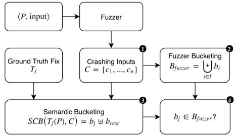

# Literature Review: Test Error Grouping/Crash Bucketing

## Semantic Crash Bucketing
**Author(s):** Rijnard van Tonder, John Kotheimer, Claire Le Goues 

**Year of Publication:** 2018  

**Link/DOI:** https://dl.acm.org/doi/pdf/10.1145/3238147.3238200

---

### Intro/Summary
Semantic Crash Bucketing (SCB) is an approach to automatically identify unique bugs by modifying a program's semantics. It groups crashing inputs based on program transformations that nullify the crashes. The approach uses bug-fixing patch templates and rule-based patch applications to approximate correct fixes. SCB ensures that crashes are grouped according to program changes that nullify those inputs, providing a way to categorize bugs semantically.

---

### Approach
Here is the SCB approach:

The developer's fix provides the best assurance of correctly fixing a bug, which is the ground truth T for SCB. But how do they obtain the approximate fix?
#### For Null Dereferences:
They inserted a simple **exit(101)** instruction when the variable is **null**. 
What about finding the variable and its location?
The general procedure for finding such crash-inducing variables works as follows:
1. Attach **GDB** to the program and run it on the crashing input.
2. Extract the source line and code reported at the crash.
3. Parse the code for pointer dereference syntax (e.g., `p->q`).
4. Working backwards, extract program variables that are dereferenced (e.g., extract p from p->q). Test, using GDB, whether the variable is null in the debugger environment.
5. If the variable is null, return the variable and associated line number. If not, move backwards a basic block and continue from (3).
If the procedure succeeds, we substitute the template program variable and insert the candidate patch just before the null dereference.
##### For Buffer Overflows:
Buffer overflows are typically fixed by performing array bounds checking on memory accesses. Thus they focus on array length. they rewrite existing calls and restrict the length of data copied to a default concrete value of 1. Restricting data to only one byte approximates a conservative angelic value that is likely to lead to non-crashing program termination.
They modified the possible problematic call (**memcpy** for example) by giving an angelic length to the array. 
How to find the problematic library calls?
The steps are as follows:
1. Use ***ltrace*** to obtain a trace of library calls from the crashing program run.
2. Working backwards, resolve the source location of library calls in the trace for which we have fixing templates.
3. Apply the template at the location and rerun the program on the original crashing input.
4. If the program no longer crashes, emit the approximate fixing patch TD. Else continue from step.

#### Tools
- **GDB:** Debugger used to find crash-inducing variables in null dereferences.
- **ltrace:** Tool to trace library calls for buffer overflow analysis.

### Dataset
- **Source:** CVE database. https://cve.mitre.org/
- **Bug Types:** Buffer overflows and null dereferences.
- **Experimental Setup:** Controlled experiments with real bugs where the ground truth fixes are known.

---

### Tags
- Crash Bucketing, Fuzzing, Bug Triage, Program Transformation, Automated Bug Fixing

---

### Notes
- SCB relies heavily on approximate fixes derived from rule-based templates and debugging tools.
- The developer’s actual fix is used as the ground truth for validating the approach.

---

## Finding Duplicates of Your Yet Unwritten Bug Report
**Author(s):** Johannes Lerch and Mira Mezini

**Year of Publication:** 2013

**Link/DOI:** https://ieeexplore.ieee.org/document/6498456

---

### Intro/Summary
Lerch and Mezini proposed an approach for detecting duplicate bug reports using only stack traces as input for machine learning algorithms. This method aims to identify potential duplicates before a new bug report is fully written, improving efficiency in bug tracking systems.

### Approach
The approach can be divided into four main steps:
1. Detection of stack traces
   They used a template containing EXCEPTION, MESSAGE, METHOD, SOURCE, and TEMPLATE to part the stack traces.
2. Indexing
   They used the notion of document and term related to search indexes. They employed the following indexed terms. The fully qualified exception type is used as a single term; any word contained in the message of length >= 3 is indexed in lower case; each fully qualified method of the call stack is considered as a single term. The source part is left out. Terms of nested stack traces are equally included, i.e. each stack trace can contribute multiple exception type terms. They used fully qualified names in normalized dot-separator representation
3. Searching
   They used term frequency and inverse document frequency approach. They computed a score for each document (each bug report).
4. Time Frames
   They worked with different time frames (limiting the amount of potential duplicates considered to a fixed time frame before the submission of a new report). They found that for Eclipse, the best results are between 200 and 800 days.

### Dataset
- Used Bugzilla entries from the Eclipse project retrieved by Zimmermann
- Dataset included 19,358 bug reports containing at least one usable stack trace
- In the evaluation all bug reports are inserted to the search
  index, but only bug reports that have duplicates already added
  to the bug tracker are used as query.