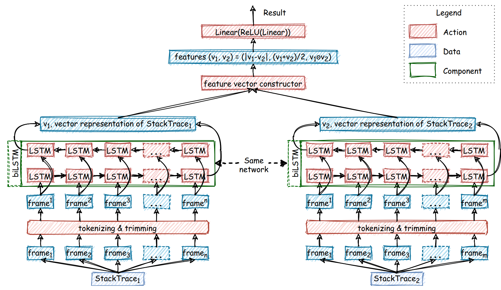

# Literature Review: Test Error Grouping/Crash Bucketing

## 📰 Semantic Crash Bucketing
**Author(s):** van Tonder et al.

**Year of Publication:** 2018  

**Link/DOI:** https://dl.acm.org/doi/pdf/10.1145/3238147.3238200

### Intro/Summary
Semantic Crash Bucketing (SCB) is an approach to automatically identify unique bugs by modifying a program's semantics. It groups crashing inputs based on program transformations that nullify the crashes. The approach uses bug-fixing patch templates and rule-based patch applications to approximate correct fixes. SCB ensures that crashes are grouped according to program changes that nullify those inputs, providing a way to categorize bugs semantically.

### Approach
Here is the SCB approach:

The developer's fix provides the best assurance of correctly fixing a bug, which is the ground truth T for SCB. But how do they obtain the approximate fix?
#### For Null Dereferences:
They inserted a simple **exit(101)** instruction when the variable is **null**. 
What about finding the variable and its location?
The general procedure for finding such crash-inducing variables works as follows:
1. Attach **GDB** to the program and run it on the crashing input.
2. Extract the source line and code reported at the crash.
3. Parse the code for pointer dereference syntax (e.g., `p->q`).
4. Working backwards, extract program variables that are dereferenced (e.g., extract p from p->q). Test, using GDB, whether the variable is null in the debugger environment.
5. If the variable is null, return the variable and associated line number. If not, move backwards a basic block and continue from (3).
If the procedure succeeds, we substitute the template program variable and insert the candidate patch just before the null dereference.
##### For Buffer Overflows:
Buffer overflows are typically fixed by performing array bounds checking on memory accesses. Thus they focus on array length. they rewrite existing calls and restrict the length of data copied to a default concrete value of 1. Restricting data to only one byte approximates a conservative angelic value that is likely to lead to non-crashing program termination.
They modified the possible problematic call (**memcpy** for example) by giving an angelic length to the array. 
How to find the problematic library calls?
The steps are as follows:
1. Use ***ltrace*** to obtain a trace of library calls from the crashing program run.
2. Working backwards, resolve the source location of library calls in the trace for which we have fixing templates.
3. Apply the template at the location and rerun the program on the original crashing input.
4. If the program no longer crashes, emit the approximate fixing patch TD. Else continue from step.

#### Tools
- **GDB:** Debugger used to find crash-inducing variables in null dereferences.
- **ltrace:** Tool to trace library calls for buffer overflow analysis.

### Dataset
- **Source:** CVE database. https://cve.mitre.org/
- **Bug Types:** Buffer overflows and null dereferences.
- **Experimental Setup:** Controlled experiments with real bugs where the ground truth fixes are known.

### Tags
- Crash Bucketing, Fuzzing, Bug Triage, Program Transformation, Automated Bug Fixing

### Notes
- SCB relies heavily on approximate fixes derived from rule-based templates and debugging tools.
- The developer’s actual fix is used as the ground truth for validating the approach.

---

## 📰 Finding Duplicates of Your Yet Unwritten Bug Report
**Author(s):** Johannes Lerch and Mira Mezini

**Year of Publication:** 2013

**Link/DOI:** https://ieeexplore.ieee.org/document/6498456

### Intro/Summary
Lerch and Mezini proposed an approach for detecting duplicate bug reports using only stack traces as input for machine learning algorithms. This method aims to identify potential duplicates before a new bug report is fully written, improving efficiency in bug tracking systems.

### Approach
The approach can be divided into four main steps:
1. Detection of stack traces
   They used a template containing EXCEPTION, MESSAGE, METHOD, SOURCE, and TEMPLATE to part the stack traces.
2. Indexing
   They used the notion of document and term related to search indexes. They employed the following indexed terms. The fully qualified exception type is used as a single term; any word contained in the message of length >= 3 is indexed in lower case; each fully qualified method of the call stack is considered as a single term. The source part is left out. Terms of nested stack traces are equally included, i.e. each stack trace can contribute multiple exception type terms. They used fully qualified names in normalized dot-separator representation
3. Searching
   They used term frequency and inverse document frequency approach. They computed a score for each document (each bug report).
4. Time Frames
   They worked with different time frames (limiting the amount of potential duplicates considered to a fixed time frame before the submission of a new report). They found that for Eclipse, the best results are between 200 and 800 days.

### Dataset
- Used Bugzilla entries from the Eclipse project retrieved by Zimmermann
- Dataset included 19,358 bug reports containing at least one usable stack trace
- In the evaluation all bug reports are inserted to the search
  index, but only bug reports that have duplicates already added
  to the bug tracker are used as query.

### Tags
- Stack Trace, Duplicate Detection, Bug Report

### Notes
- This approach focuses solely on stack traces, which can be beneficial when bug descriptions are informal or unreliable. 
- Subsequent studies have cited this work, indicating its influence in the field of software maintenance and bug tracking. 

--- 
## 📰 TraceSim: A Method for Calculating Stack Trace Similarity 
**Author(s):** Vasiliev et al.

**Year of Publication:** 2020

**Link/DOI:** 

### Intro/Summary
Vasiliev et al. addressed the problem f computing stack track similarity by constructing a measure that combines TF-IDF, edit distance, and supervised machine learning.
### Approach
The suggested algorithm is as follows:
1. Separate processing of Stack Overflow Exceptions (SOEs): In  this case they use the TF-IDF algorithm.
2. Frame weight computation: They considered different weight for different frames in a stack. Differences in frames that are close to the top of the stack were considered more important, i.e., error are more likely caused by the functions which were called last. To calculate the overall weight of a frame, they identified two factors: local weight of that frame which is relative to its position in the trace and the global weight which represents the importance of that frame for the whole corpus of stack traces. The global weight is calculated according to TF-IDF approach.
3.  Levenshtein distance calculation: They used this distance to express the distance between two stack traces. They also considered the weight of each frame.
4. Normalization: They use a normalized similarity value instead of directly using the calculated distance.
5. Hyperparameter Estimation via Machine Learning: They formulate an optimization problem to calculate the parameters of weights. They trained on a manually labeled sub dataset. The Tree-structured Parzen Estimator Approach was used.

### Dataset
They used the JetBrains crash report processing system Exception Analyzer which handles reports and automatically distributes them into buckets.
To be able to evaluate the method, they observed developer's behaviour: They extracted and analyzed
reports from recent user action logs of Exception Analyzer
spanning one year time frame. To create positive pairs they have
analyzed user sessions and searched for the following pattern:
for a particular unbucketed report, a user looks into some issue,
compares it to a particular report of this issue and then assigns
it into the issue. To obtain negative pairs they exploit a similar
idea: they designate a pair as negative if a user compared reports
and did not group them.
### tags
- Crash Reports, Duplicate Bug Report, Duplicate Crash Report, Crash Report Deduplication, Information
  Retrieval, Software Engineering, Automatic Crash Reporting,
  Deduplication, Crash Stack, Stack Trace, Automatic Problem
  Reporting Tools, Software Repositories.
### Notes
- They concluded that the global weight parameter contributed significantly to the result. 
- Link to implementation: https://github.com/traceSimSubmission/trace-sim/blob/master/trace_sim.py

---
## 📰 S3M: Siamese Stack (Trace) Similarity Measure

**Author(s):** Khvorov et al. 

**Year of Publication:** 2021

**Link/DOI:** https://arxiv.org/abs/2103.10526

### Intro/Summary
Khvorov et al. introduced S3M ("extreme"), the first deep learning approach for calculating stack trace similarity in crash report deduplication. This method utilizes a siamese architecture with a biLSTM encoder and two fully-connected layers as a classifier.

### Approach

The S3M approach consists of four main steps:
1. Preprocessing (Tokenization and Trimming)
Experimented with different types of trace trimming.
2. Vector Representation of Stack Traces
Utilized a biLSTM network for encoding.
3. Algorithm
Fed encoded representations into a fully connected 2-layer network.
4. Training
Used RankNet loss to enhance ranking accuracy.

### Dataset
- Public dataset: NetBeans
- Private dataset: JetBrains stack traces

### tags
- Crash Report, Stack Trace, Deduplication, Automatic Crash Reporting, Deep Learning 

### Notes
---
## 📰 The Unreasonable Effectiveness of Traditional Information Retrieval in Crash Report Deduplication
**Author(s)**: Campbell et al.

**Year of Publication**: 2016

**Link/DOI**: https://softwareprocess.es/pubs/campbell2016MSR-partycrasher.pdf

### Intro/Summary
Campbell et al. extended the work of Lerch and Mezini by presenting PartyCrasher, a framework for bucketing crash reports. They evaluated existing methods for crash report deduplication and proposed criteria for assessing these methods, highlighting the effectiveness of traditional information retrieval techniques in this domain.
### Approach
The approach involves several key criteria for crash report deduplication methods:
- Each new incoming crash must be able to be assigned a bucket in *O(log n)* time or better.
- The method must be *online*.
- The method must be *unsupervised*.
- The method must be *non-stationary*.
A general-purpose Python framework was developed to support and evaluate various deduplication methods by simulating automated crash reports arriving over time.
### Dataset
Used a mining tool (Bicho) to extract crash reports from Ubuntu's bug repository.
Many of the bug reports in Ubuntu's repository have been manually deduplicated by humans.
### Tags
- Near-duplicate and plagiarism detection; Software testing and debugging; Maintaining software;
--- 
## 📰 Igor: Crash Deduplication Through Root-Cause Clustering
**Author(s):** Jiang et al. 
**Year of Publication:** 2021  
**Link/DOI:** https://netsec.ccert.edu.cn/publications/ccs21-igor

### Intro/Summary
Jiang et al. developed Igor, an automated dual-phase crash deduplication technique that combines a coverage-reduction fuzzer with a control-flow graph (CFG) similarity metric to effectively cluster crashes. The goal of Igor is to minimize the number of reported crashes in software testing by refining proof-of-concept (PoC) test cases for observed unique crashes. The authors argue that existing techniques often inflate bug counts and conflate unrelated bugs, necessitating more accurate methods.

### Approach
Igor operates through two main phases:
1. **Minimization of Execution Traces**: It reduces each PoC's execution trace to focus on critical behaviors necessary for triggering a bug.
2. **Clustering via CFG Similarity**: It utilizes a similarity metric based on control-flow graphs to group crashes into identifiable clusters.

The approach addresses the stochastic nature of fuzzing, which often leads to diverse crashes that complicate bug tracking. By accurately clustering crashes, Igor aims to reduce the inflation of bug counts and improve the efficiency of bug analysis.

### Dataset
- Evaluated against 39 bugs resulting from 254,000 PoCs across 10 different programs.
- Demonstrated that Igor could accurately group these crashes into 48 uniquely identifiable clusters, significantly reducing the reported bug counts compared to other state-of-the-art methods.

### Tags
Crash deduplication, automated testing, fuzzing, control-flow graphs, software engineering

### Notes
- Igor's methodology highlights the limitations of traditional crash bucketing techniques that rely on crash sites or coverage profiles, which can lead to misclassification and inflated bug counts.
- The results indicate that Igor provides a more reliable means of crash grouping, ultimately saving developer time and resources.
- This work contributes to the ongoing effort to enhance the effectiveness of automated tools in software testing by minimizing noise in crash reports.

---

---
## 📰 [Article Tile]
**Author(s):**
**Year of Publication:**
**Link/DOI:** 

### Intro/Summary
### Approach
### Dataset
### tags
### Notes
